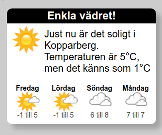

# Enkla vädret

## För att se på Herokuapp
Publicerad här: https://enkla-vadret.herokuapp.com/

## För att köra appen lokalt
- `npm install` för att installera node moduler
- `npm run dev` för att starta API och webserver
- Öppna `http://localhost:9090` i en browser

